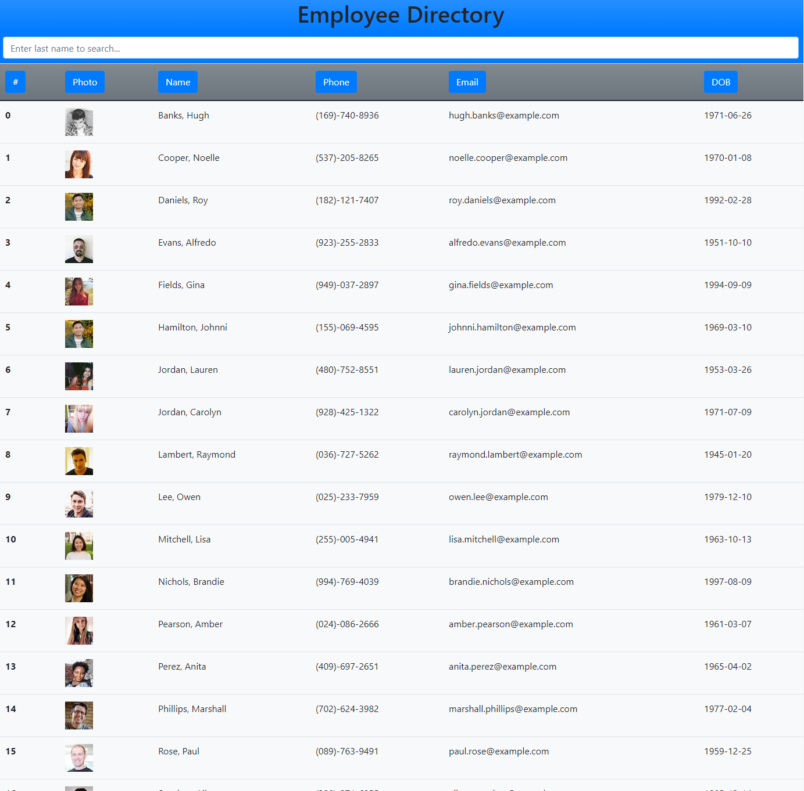

# employee-directory

Search, sort and view employees in React

## Table of Contents

- [employee-directory](#employee-directory)
- [Description](#description)
- [Installation](#installation)
- [Usage](#usage)
- [Licence](#licence)
- [Contributing](#contributing)
- [Questions](#questions)

## Description



This is a simple React-based app which uses the Randomuser.me API to generate a list of simulated employees, which one can search and sort by last name.

[Deployed GitHub Pages Site](https://brhestir.github.io/employee-directory/)

[GitHub Repo](https://www.github.com/brhestir/employee-directory)

## Installation

```bash
npm install
```

## Usage

```bash
npm start
```

## Licence


## Contributing

Clone this repo and create a pull request.

## Questions

Questions/comments/suggestions welcome.
